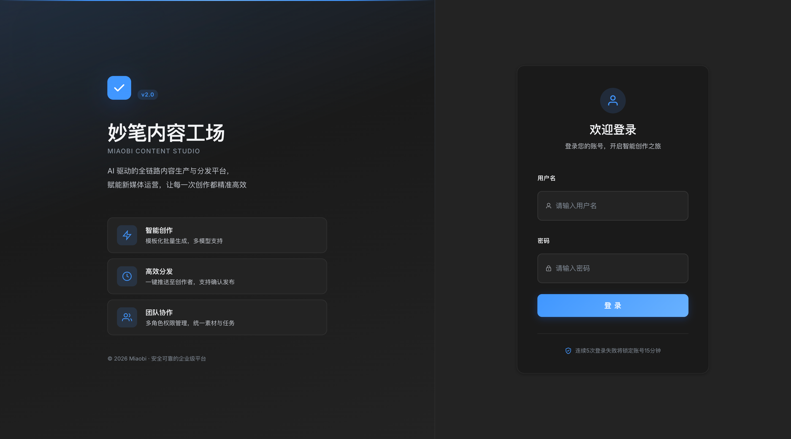
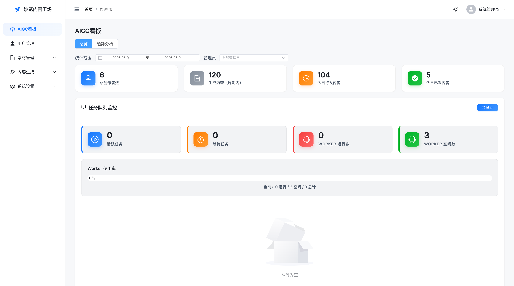
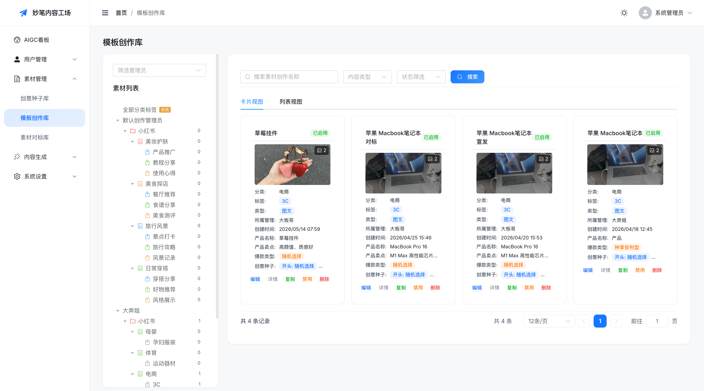
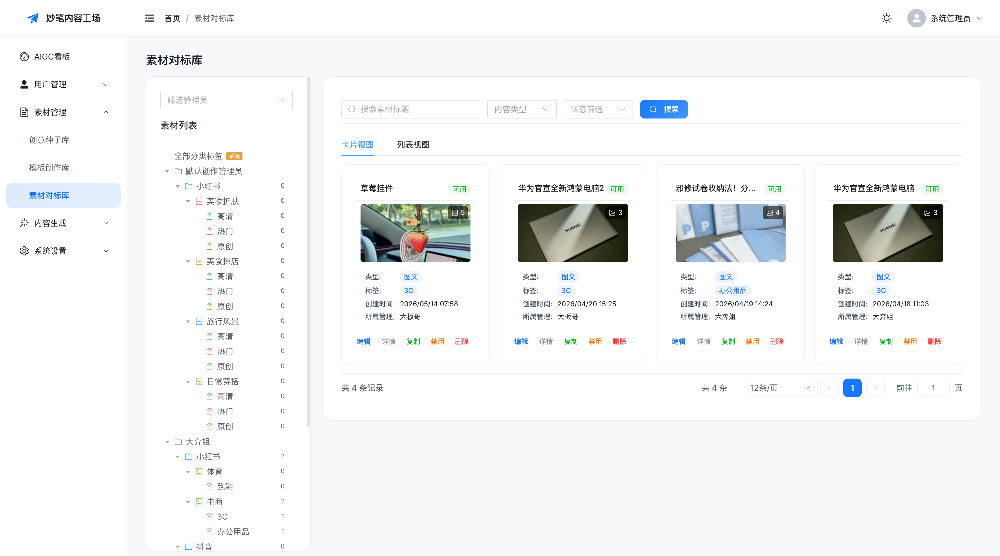
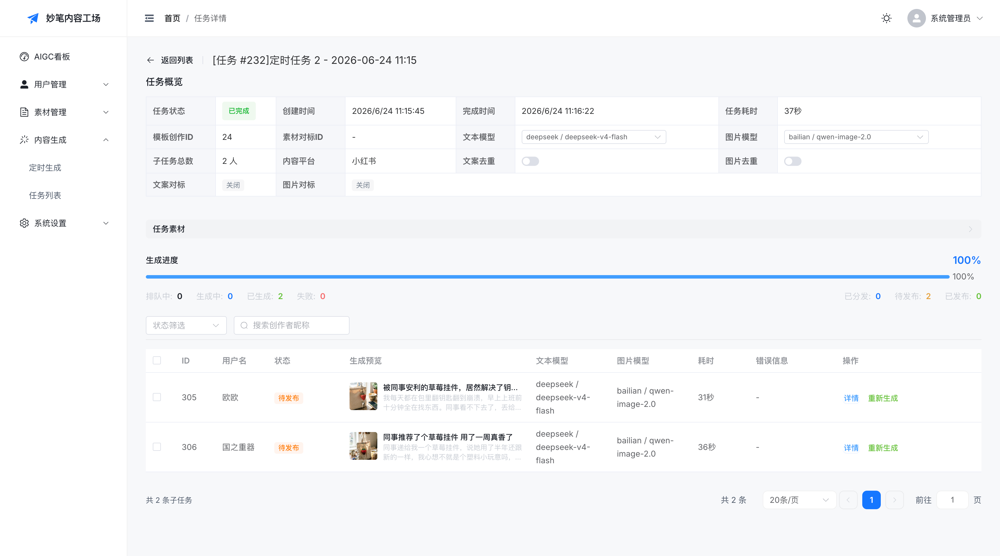
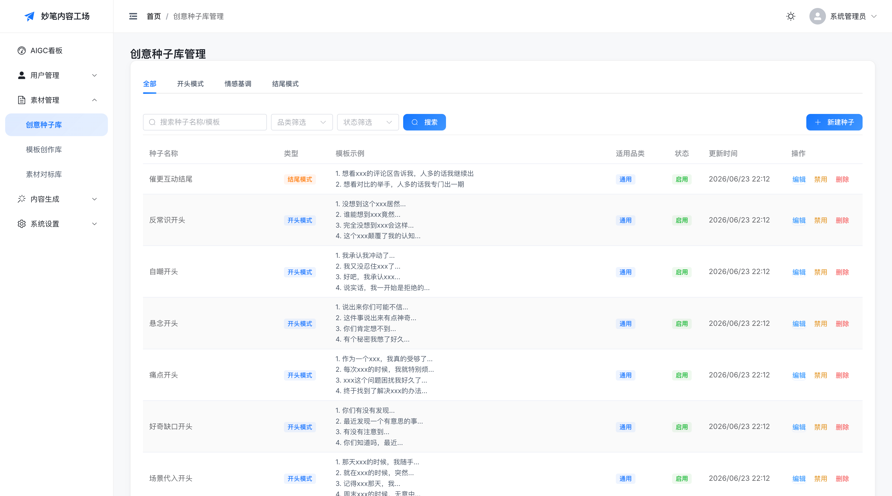
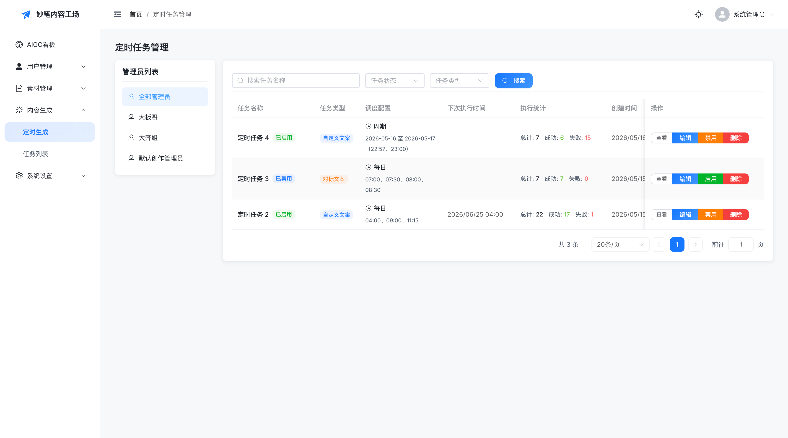

# 妙笔内容工场

<div align="center">


**面向自媒体运营团队的 AI 内容生产与分发中枢**

[产品介绍](#产品介绍) • [核心功能](#核心功能) • [技术架构](#技术架构) • [快速开始](#快速开始) • [文档](#文档)

</div>

---

## 产品介绍

妙笔内容工场是一套以「素材沉淀、智能创作、批量生成、团队分发、发布确认」为核心链路的 SaaS 系统。它将大模型能力、内容资产管理、运营协同和多角色权限体系整合到同一工作台，帮助团队把灵感、素材和模板转化为稳定、可追踪、可规模化交付的内容生产力。

### 核心价值

- ✅ **高效创作流水线** — 通过模板、素材、对标内容和模型配置，将重复创作流程产品化
- ✅ **稳定内容质量** — 支持参考素材、提示词模板、生成参数、去重检测和执行日志追踪
- ✅ **清晰团队协作** — 超级管理员、创作管理员、创作者三类角色分工明确，数据边界清晰
- ✅ **可控规模化交付** — 批量任务、并发控制、失败重试、实时进度与发布确认统一管理
- ✅ **私有化部署友好** — 基于 Docker 的标准化交付方式，适合企业内部部署和二次开发

---

## 核心功能

### 1. 内容资产管理
- **素材库管理** — 创作库、对标库、文本/图片/视频上传、标签分类、收藏
- **模板管理** — Prompt 可视化编辑、变量占位符、平台规则、图片/视频参数、模板复制
- **四级分类体系** — 平台 → 分类 → 标签 → 条目，方便规模化资产管理
- **对象存储集成** — 支持腾讯云 COS 挂载式目录结构，便于文件统一管理

### 2. AI 内容生成
- **批量生成** — 7 步骤任务向导、多模型接入、并发控制、限流、失败重试
- **多模型支持** — 百炼、火山引擎、即梦、可灵、AutoGLM、月之暗面、DeepSeek、灵牙 AI
- **三阶段事务架构** — 读取数据（<1秒）→ AI 生成（30-90秒）→ 保存结果（<1秒），彻底解决连接池耗尽问题
- **实时进度推送** — WebSocket 实时推送任务进度，前端实时更新

### 3. 质量控制
- **智能去重** — 文案去重、图片去重、Embedding 相似度检测
- **向量缓存** — 内容向量缓存，降低批量生成内容的重复风险
- **执行日志** — 完整的执行日志追踪，便于问题排查和审计
- **失败重试** — 自动重试机制，失败任务可手动重试

### 4. 内容分发
- **批量分发** — 创作管理员可将生成内容批量分发给创作者
- **状态跟踪** — 实时跟踪内容分发状态（待发布、已发布、已确认）
- **一键操作** — 创作者可一键复制文本、下载图片/视频
- **发布确认** — 创作者确认发布状态，形成完整闭环

### 5. 用户与权限
- **三角色权限** — 超级管理员、创作管理员、创作者，权限边界清晰
- **多租户隔离** — 通过 `owner_admin_id` 实现创作管理员维度的数据隔离
- **邀请码注册** — 支持邀请码注册机制，控制用户准入
- **用户标签** — 支持用户标签管理，便于用户分组和筛选

### 6. 系统运维
- **Docker 部署** — 标准化 Docker Compose 部署，确保环境一致性
- **数据库备份** — 自动备份和手动备份支持
- **健康检查** — 服务健康检查和监控
- **日志查看** — 集中式日志查看和管理

---

## 功能展示

### 1. 登录页面



简洁的登录界面，支持账号密码登录，提供安全验证机制。

---

### 2. 仪表盘（Dashboard）



多维度数据统计卡片，实时展示任务进度、内容生成状态、用户活跃度等关键指标。

---

### 3. 模板库管理



左侧分类树导航，右侧卡片/列表双视图切换，支持模板搜索、编辑、复制、禁用等操作。

---

### 4. 素材库管理



四级分类体系（平台 → 分类 → 标签 → 条目），支持文本/图片/视频素材上传、标签管理、批量操作。

---

### 5. 内容生成任务详情



实时进度追踪，WebSocket 推送任务状态，支持批量暂停/继续、失败重试、子任务详情查看。

---

### 6. 创意种子库



创意灵感管理库，支持按类型分类（风格/主题/场景等），系统预置种子与自定义种子结合，为内容生成提供创意源泉。

---

### 7. 定时任务管理



定时生成任务配置，支持 Cron 表达式自定义执行时间，自动触发批量内容生成，实现无人值守的内容生产流程。

---

## 技术架构

### 分层架构

项目采用 **前后端分离 + 微服务架构** 模式：

```
Frontend Layer (Vue 3 + Element Plus)
        ↓ HTTP/WebSocket
Backend Layer (FastAPI + Celery)
        ↓
Service Layer (Business Logic + AI Adapter)
        ↓
Data Layer (MySQL + Redis + COS)
```

### 技术栈

| 类别 | 技术 | 版本 |
|------|------|------|
| **后端框架** | FastAPI | Python 3.11+ |
| **ORM** | SQLAlchemy | 2.0+ |
| **数据库迁移** | Alembic | — |
| **数据库** | MySQL | 8.0+ |
| **缓存** | Redis | 7.0+ |
| **异步队列** | Celery | — |
| **前端框架** | Vue 3 | TypeScript |
| **构建工具** | Vite | — |
| **UI 库** | Element Plus | — |
| **对象存储** | 腾讯云 COS | — |
| **实时通信** | WebSocket | — |
| **认证机制** | JWT | 双 Token |

### 核心设计模式

| 模式 | 应用场景 |
|------|---------|
| **策略模式** | AI 模型适配器（`BaseModelAdapter` 抽象基类） |
| **工厂模式** | `ModelAdapterFactory` 根据平台类型自动创建适配器 |
| **三阶段事务** | AI 生成流程拆分为读取、生成、保存三个独立阶段 |
| **观察者模式** | WebSocket 实时推送任务进度 |
| **多租户隔离** | 通过 `owner_admin_id` 实现数据隔离 |

### AI 模型适配器

| 平台 | 适配器 | 支持能力 | 认证方式 |
|------|---------|---------|---------|
| 阿里百炼 | `BailianAdapter` | chat / image / video / embedding | API Key |
| 火山引擎 | `VolcengineAdapter` | chat / image / video / embedding | API Key |
| 即梦（字节跳动） | `JimengAdapter` | image / video | AK/SK |
| 可灵（快手） | `KlingAdapter` | video / image | AK/SK |
| AutoGLM | `AutoGLMAdapter` | chat / multimodal | API Key |
| 月之暗面（Kimi） | `MoonshotAdapter` | chat / embedding | API Key |
| DeepSeek | `DeepSeekAdapter` | chat / embedding | API Key |
| 灵牙 AI | `LingyaAdapter` | chat / multimodal | API Key |

---

## 项目结构

```
miaobi_aigc_factory/
├── platform_api/                    # FastAPI 后端服务
│   ├── app/
│   │   ├── api/                    # API 路由
│   │   ├── models/                 # 数据库模型
│   │   ├── schemas/                # Pydantic 模型
│   │   ├── services/               # 业务逻辑
│   │   ├── tasks/                  # Celery 任务
│   │   └── utils/                  # 工具函数
│   ├── alembic/                    # 数据库迁移
│   ├── tests/                      # 测试代码
├── platform_web/                    # Vue 3 Web 管理后台
│   ├── src/
│   │   ├── api/                    # API 客户端
│   │   ├── components/             # 组件
│   │   ├── views/                  # 页面
│   │   ├── stores/                 # Pinia Store
│   │   └── utils/                  # 工具函数
├── docs/                            # 项目文档
├── scripts/                         # 部署脚本
├── docker/                          # Docker 配置
├── tests/                           # 集成测试
├── Makefile                         # 常用命令入口
```

---

## 快速开始

### 环境要求

- Docker 20.10+
- Docker Compose 2.0+
- 开发环境建议：4GB+ 可用内存、20GB+ 可用磁盘
- 生产环境建议：8GB+ 可用内存、50GB+ 可用磁盘

### 安装步骤

#### 1. 克隆项目

```bash
git clone https://github.com/iamyumingfeng/miaobi-content-factory.git
cd miaobi-content-factory
```

#### 2. 开发环境部署

```bash
# Docker 部署开发环境
make dev-deploy-docker

# 查看服务状态
make dev-status

# 查看服务日志
make dev-logs
```

#### 3. 访问应用

| 服务 | 地址 |
|------|------|
| Web 管理后台 | http://localhost |
| 后端 API | http://localhost:8000 |
| API 文档 | http://localhost:8000/docs |

#### 4. 环境变量配置

首次部署前，需要配置 `.env` 文件中的必要参数：

##### 🔴 必须修改的配置

```bash
# JWT 密钥（必须修改，用于 Token 签名）
# 生成方法: python3 -c "import secrets; print(secrets.token_urlsafe(64))"
SECRET_KEY=your-random-secret-key-here-change-this-in-production

# 数据库密码（生产环境必须修改）
MYSQL_PASSWORD=your_secure_password
MYSQL_ROOT_PASSWORD=your_secure_root_password

# Redis 密码（生产环境必须修改）
REDIS_PASSWORD=your_redis_password
```

##### ⚠️ 生产环境必须配置

```bash
# CORS 允许的域名（生产环境必须修改）
CORS_ORIGINS=["https://yourdomain.com"]

# API 地址（生产环境必须修改）
VITE_API_BASE_URL=https://api.yourdomain.com/api/v1

# 腾讯云 COS 配置（生产环境必须配置）
COS_SECRET_ID=your-cos-secret-id
COS_SECRET_KEY=your-cos-secret-key
COS_BUCKET=your-bucket-name
COS_REGION=ap-guangzhou
```

##### ✅ 可选配置（按需配置）

```bash
# AI 模型 API Key（使用 AI 功能时才需要配置）
BAILIAN_API_KEY=your-bailian-api-key
VOLCANO_API_KEY=your-volcano-api-key
DEEPSEEK_API_KEY=your-deepseek-api-key
# ... 其他模型配置

# Celery 并发数（根据服务器性能调整）
CELERY_CONCURRENCY=4  # 2核CPU建议2，4核CPU建议4
```

##### 📝 配置说明

- **开发环境**：只需修改 `SECRET_KEY`，其他保持默认即可
- **生产环境**：必须修改所有标记为 🔴 和 ⚠️ 的配置项
- **详细配置**：参考 [环境变量配置指南](docs/env-config-guide.md)

#### 5. 生产环境部署

```bash
# 复制生产环境配置
cp .env.prod.example .env

# 编辑配置文件
vi .env

# 生产环境部署
make prod-deploy

# 查看服务状态
make prod-status
```

---

## 常用命令

### 开发环境

```bash
make dev-deploy-docker    # Docker 部署开发环境
make dev-status           # 查看服务状态
make dev-logs             # 查看服务日志
make dev-stop             # 停止服务
make dev-restart          # 重启服务
```

### 生产环境

```bash
make prod-deploy          # 首次部署
make prod-upgrade         # 升级部署
make prod-rollback        # 回滚版本
make prod-status          # 查看服务状态
make prod-logs            # 查看服务日志
make prod-backup          # 手动备份
```

查看完整命令：

```bash
make help
```

---

## 默认账号

| 字段 | 默认值 |
|------|--------|
| 用户名 | `admin_root` |
| 密码 | `admin_root123` |

⚠️ **安全提示**：首次登录后请立即修改默认密码，并替换生产环境中的密钥、数据库密码和对象存储配置。

## 文档

### 产品文档
- [产品需求文档（PRD）](docs/media-aigc-platform-prd.md) — 用户故事、验收标准、核心功能
- [Web UI 设计文档](docs/web-ui-design.md) — 设计系统、交互规范、响应式布局

### 技术文档
- [技术架构文档](docs/architecture.md) — 分层架构、三阶段事务、模型适配器
- [API 设计文档](docs/api-design.md) — RESTful API、WebSocket、认证机制
- [核心数据模型分析](docs/data-model-analysis.md) — ER 图、多租户隔离、索引设计

### 部署文档
- [开发环境部署指南](docs/dev-deploy-guide.md) — Docker 部署、环境配置
- [生产环境部署指南](docs/prod-deploy-guide.md) — 生产部署、备份恢复
- [Docker 配置指南](docs/docker-guide.md) — 容器配置、网络配置
- [环境变量配置指南](docs/env-config-guide.md) — 环境变量说明

### 业务文档
- [批量生成工作流](docs/batch-generation-workflow.md) — 任务创建、并发控制、失败重试
- [任务队列管理](docs/task-queue-management.md) — Celery 配置、任务调度
- [定时任务设计](docs/scheduled_task_design.md) — 定时任务配置、执行策略

### 版本与协作
- [版本更新日志](CHANGELOG.md)

---

## 开发指南

### 编码规范

#### Python 后端
- 遵循 PEP 8 规范
- 使用 Black 格式化代码
- 使用类型注解（Type Hints）
- **关键**：遵循三阶段事务架构，避免长时间持有数据库连接

#### Vue 前端
- 使用 TypeScript
- 遵循 Vue 3 Composition API 风格
- 使用 `<script setup>` 语法糖
- 遵循 Element Plus 设计系统规范

### 命名规范

| 类型 | 规范 | 示例 |
|------|------|------|
| Python 类名 | PascalCase | `GenerationTask` |
| Python 函数名 | snake_case | `get_user_by_id` |
| Vue 组件名 | PascalCase | `UserProfile.vue` |
| Vue 文件名 | PascalCase + View 后缀 | `UsersView.vue` |

### 提交规范

```
type(scope): subject

type: feat | fix | docs | style | refactor | test | chore
scope: api | web | db | deploy | config
```

示例:
```
feat(api): 添加三阶段事务架构支持
fix(web): 修复登录页面样式问题
docs(api): 更新 API 接口文档
```

### 分支管理

- `master` — 主分支（保护）
- `feature/*` — 功能分支
- `bugfix/*` — 修复分支
- `hotfix/*` — 紧急修复
- `release/*` — 发布分支

### 架构原则

- **三阶段事务** — AI 生成流程必须拆分为三个独立阶段
- **单一职责** — 每个模块只负责一个功能领域
- **依赖倒置** — 依赖抽象而非具体实现
- **接口隔离** — 使用接口定义契约

---

## 测试

### 单元测试

```bash
# 后端测试
cd platform_api
pytest

# 前端测试
cd platform_web
npm run test
```

### 测试覆盖率

```bash
# 后端覆盖率
cd platform_api
pytest --cov=app

# 前端覆盖率
cd platform_web
npm run test:coverage
```

### 质量门禁

| 门禁 | 检查方式 | 通过标准 |
|------|---------|---------|
| 编译通过 | `pytest` / `npm run build` | 无错误 |
| Lint 通过 | `flake8` / `eslint` | 0 errors, 0 warnings |
| 测试通过 | `pytest` / `npm run test` | 全部通过 |
| 覆盖率（中/大任务） | `pytest --cov` / `npm run test:coverage` | ≥ 80% |

---

## 版本历史

### v1.0.0（当前版本，2026-Q2）

#### ✅ 已完成
- 基础内容管理（素材库、模板库）
- AI 内容生成（批量生成、多模型支持）
- 三阶段事务架构（核心优化）
- 内容分发与发布确认
- 用户与权限管理（三角色权限）
- Docker 部署与运维
- 实时进度推送（WebSocket）

#### 📋 规划中

| 版本 | 预计时间 | 核心特性 |
|------|---------|---------|
| v1.1.0 | 2026-Q3 | 小程序支持、移动端适配 |
| v1.2.0 | 2026-Q4 | 多语言支持、国际化 |

---

## 贡献指南

欢迎提交 Issue、Pull Request 或产品建议。参与开发前请阅读：

1. Fork 项目
2. 创建特性分支（`git checkout -b feature/amazing-feature`）
3. 提交更改（`git commit -m 'feat: add some amazing feature'`）
4. 推送到分支（`git push origin feature/amazing-feature`）
5. 创建 Pull Request

### 代码审查清单

- [ ] 编译通过（后端 `pytest` / 前端 `npm run build`）
- [ ] 测试通过（后端 `pytest` / 前端 `npm run test`）
- [ ] 符合命名规范（类名 PascalCase、函数名 snake_case）
- [ ] 无硬编码字符串（使用配置文件）
- [ ] 无硬编码颜色（使用 Element Plus 主题）
- [ ] 异常已处理（try-catch）
- [ ] 添加了单元测试（中/大功能）
- [ ] 更新了相关文档

---

## 安全与合规

### ⚠️ 重要安全提示

- 🔴 **必须修改**: 生产环境必须修改默认账号密码、JWT 密钥、数据库密码和对象存储密钥
- 🔴 **内容合规**: 用户必须自行审核生成内容,确保内容合法、合规、真实
- 🔴 **平台规则**: 本项目不与任何第三方内容平台存在官方合作关系,使用者需自行遵守对应平台规范
- 🔴 **责任声明**: 用户对生成内容的合规性和发布行为承担全部法律责任

### 📋 免责声明

**使用本软件前请务必阅读 [免责声明](DISCLAIMER.md)**,明确以下责任:

- 用户对生成内容的合规性负全部责任
- 用户需自行审核 AI 生成内容,确保不违法违规
- 用户需遵守目标发布平台的规则和政策
- 软件开发者不对用户使用行为承担责任

### 🔒 安全报告

如发现安全问题,请参考 [安全政策](SECURITY.md) 进行私密报告。

---

## 许可证

本项目采用 [MIT License](LICENSE) 开源许可证。

Copyright © 2025 Miaobi Content Factory Contributors

---

## 联系方式

- 问题反馈: [GitHub Issues](https://github.com/iamyumingfeng/miaobi-content-factory/issues)
- 安全问题: iamyumingfeng@163.com

---

<div align="center">

**安全提示**：API Key 等敏感信息请妥善保管，不要提交到代码仓库。

</div>